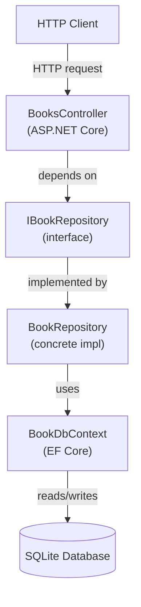

# Design Document: Books API

## Overview

The Books API is a RESTful .NET Core Web API application that exposes five CRUD endpoints for managing a collection of books. Data is persisted in a SQLite database accessed through Entity Framework Core. The Repository pattern decouples data-access logic from the controller layer, keeping controllers thin and business logic independently testable.

The application is structured around three layers:

1. **API Layer** — ASP.NET Core controllers that handle HTTP routing, request validation, and response shaping.
2. **Repository Layer** — An interface-driven abstraction over EF Core, responsible for all database operations.
3. **Data Layer** — Entity Framework Core `DbContext` and migrations that manage the SQLite schema.

---

## Architecture



**Dependency injection** wires `IBookRepository → BookRepository` and `BookDbContext` as scoped services. Controllers never reference concrete implementations directly.

**Startup sequence:**
1. DI container is configured (DbContext, Repository, controllers).
2. Before the first request, pending EF Core migrations are applied. If migration fails, the application halts.
3. The HTTP pipeline begins serving requests.

---

## Components and Interfaces

### BooksController

Handles all HTTP routing under `/api/books`. Each action method:
- Validates the route parameter and model state before calling the repository.
- Maps repository results to HTTP responses.
- Catches database-related exceptions and returns `503 Service Unavailable`.

| Action | Route | HTTP Method | Success Response |
|---|---|---|---|
| `GetAll` | `/api/books` | GET | 200 + JSON array |
| `GetById` | `/api/books/{id}` | GET | 200 + JSON object |
| `Create` | `/api/books` | POST | 201 + created object |
| `Update` | `/api/books/{id}` | PUT | 200 + updated object |
| `Delete` | `/api/books/{id}` | DELETE | 204 No Content |

### IBookRepository

```csharp
public interface IBookRepository
{
    Task<IEnumerable<Book>> GetAllAsync();
    Task<Book?> GetByIdAsync(int id);
    Task<Book> AddAsync(Book book);
    Task<Book?> UpdateAsync(int id, Book book);
    Task<bool> DeleteAsync(int id);
}
```

- `GetByIdAsync` returns `null` when the id does not exist.
- `UpdateAsync` returns `null` when the id does not exist.
- `DeleteAsync` returns `false` when the id does not exist, `true` on successful deletion.

### BookRepository

Concrete implementation of `IBookRepository`. Uses the injected `BookDbContext` for all database operations via EF Core async APIs (`FindAsync`, `ToListAsync`, `SaveChangesAsync`, etc.). Does not catch exceptions — exceptions propagate to the controller.

### BookDbContext

```csharp
public class BookDbContext : DbContext
{
    public DbSet<Book> Books { get; set; }
    // OnModelCreating configures column constraints
}
```

Registered as a scoped service with the SQLite connection string sourced from `appsettings.json`.

### Data Transfer Objects (DTOs)

Two DTOs keep the API contract separate from the domain entity:

- **`CreateBookDto`** — used for POST requests. Contains Title, Author, Pages, Language, Genre, CoverImageUrl (optional).
- **`UpdateBookDto`** — used for PUT requests. Contains the same fields as `CreateBookDto`.

Data annotation attributes on DTOs drive ASP.NET Core model validation, returning `400 Bad Request` automatically when validation fails.

### Middleware / Error Handling

A global exception-handling middleware (or `UseExceptionHandler`) catches unhandled exceptions from the repository layer and returns:
- `503 Service Unavailable` for database connectivity exceptions.
- `500 Internal Server Error` for all other unhandled exceptions.

---

## Data Models

### Book Entity

```csharp
public class Book
{
    public int Id { get; set; }

    [Required]
    [MaxLength(500)]
    public string Title { get; set; } = string.Empty;

    [Required]
    [MaxLength(300)]
    public string Author { get; set; } = string.Empty;

    [Range(1, 50000)]
    public int Pages { get; set; }

    [Required]
    public string Language { get; set; } = string.Empty;

    [Required]
    public string Genre { get; set; } = string.Empty;

    public string? CoverImageUrl { get; set; }
}
```

### Database Schema (Books table)

| Column | Type | Constraints |
|---|---|---|
| Id | INTEGER | PRIMARY KEY AUTOINCREMENT |
| Title | TEXT | NOT NULL, max 500 chars |
| Author | TEXT | NOT NULL, max 300 chars |
| Pages | INTEGER | NOT NULL, range 1–50000 |
| Language | TEXT | NOT NULL |
| Genre | TEXT | NOT NULL |
| CoverImageUrl | TEXT | NULL allowed |

> **Note on Update validation:** Requirement 4.5 specifies a 200-character limit on Title for PUT, while Requirement 3.3 specifies 500 characters for POST. The `UpdateBookDto` will enforce 200 characters, while `CreateBookDto` enforces 500. The database schema stores up to 500 to accommodate the looser create constraint.

### CreateBookDto

```csharp
public class CreateBookDto
{
    [Required(ErrorMessage = "Title is required.")]
    [MaxLength(500, ErrorMessage = "Title must not exceed 500 characters.")]
    public string Title { get; set; } = string.Empty;

    [Required(ErrorMessage = "Author is required.")]
    [MaxLength(300, ErrorMessage = "Author must not exceed 300 characters.")]
    public string Author { get; set; } = string.Empty;

    [Range(1, 50000, ErrorMessage = "Pages must be between 1 and 50000.")]
    public int Pages { get; set; }

    [Required(ErrorMessage = "Language is required.")]
    public string Language { get; set; } = string.Empty;

    [Required(ErrorMessage = "Genre is required.")]
    public string Genre { get; set; } = string.Empty;

    public string? CoverImageUrl { get; set; }
}
```

### UpdateBookDto

```csharp
public class UpdateBookDto
{
    [Required(ErrorMessage = "Title is required.")]
    [MaxLength(200, ErrorMessage = "Title must not exceed 200 characters.")]
    public string Title { get; set; } = string.Empty;

    [Required(ErrorMessage = "Author is required.")]
    public string Author { get; set; } = string.Empty;

    [Range(1, 99999, ErrorMessage = "Pages must be between 1 and 99999.")]
    public int Pages { get; set; }

    public string Language { get; set; } = string.Empty;
    public string Genre { get; set; } = string.Empty;
    public string? CoverImageUrl { get; set; }
}
```

---

## Correctness Properties

*A property is a characteristic or behavior that should hold true across all valid executions of a system — essentially, a formal statement about what the system should do. Properties serve as the bridge between human-readable specifications and machine-verifiable correctness guarantees.*

### Property 1: Create-then-retrieve round trip

*For any* valid `CreateBookDto` (Title ≤ 500 chars, Author ≤ 300 chars, Pages in [1, 50000], non-empty Language and Genre), posting the book and then retrieving it by the returned Id SHALL return a book whose fields match the submitted values exactly.

**Validates: Requirements 3.1, 6.1**

### Property 2: Invalid input is always rejected

*For any* `CreateBookDto` where at least one field violates its constraint (empty/null Title or Author, Pages < 1 or > 50000, empty Language, empty Genre, or Title > 500 chars), the API SHALL return a 400 response and SHALL NOT persist any record.

**Validates: Requirements 3.2, 3.3, 3.4, 3.5, 3.6, 3.7, 3.8**

### Property 3: Update reflects submitted fields

*For any* existing book and any valid `UpdateBookDto`, submitting a PUT request SHALL return a 200 response whose body reflects every submitted field, and a subsequent GET by Id SHALL return the same updated values.

**Validates: Requirements 4.1**

### Property 4: Delete removes the record

*For any* existing book Id, deleting it SHALL return 204, and any subsequent GET by the same Id SHALL return 404.

**Validates: Requirements 5.1**

### Property 5: Non-existent Id always returns 404

*For any* integer Id that does not correspond to a persisted book, GET, PUT, and DELETE requests to `/api/books/{id}` SHALL each return 404.

**Validates: Requirements 2.2, 4.2, 5.2**

---

## Error Handling

| Scenario | HTTP Status | Notes |
|---|---|---|
| Successful GET (list) | 200 | Empty array when no records exist |
| Successful GET (single) | 200 | All fields included |
| Book not found | 404 | Applies to GET, PUT, DELETE by Id |
| Invalid Id format (non-integer / ≤ 0) | 400 | Route constraint + validation attribute |
| Validation failure (POST/PUT body) | 400 | ASP.NET Core model state validation |
| Successful POST | 201 | `Location` header set to new resource |
| Successful PUT | 200 | Updated resource in body |
| Successful DELETE | 204 | No body |
| Database unavailable | 503 | Global exception handler |
| Unhandled server error | 500 | Global exception handler |

**Error response shape** (consistent across all 4xx/5xx):

```json
{
  "error": "Human-readable error message"
}
```

For model validation errors (400), ASP.NET Core's default `ValidationProblemDetails` shape is acceptable and should be kept consistent.

**Global exception handling strategy:**

- Middleware inspects exception type.
- `DbException` (and subtypes) → 503.
- All others → 500.
- Exceptions are logged before the response is sent.

---

## Testing Strategy

### Unit Tests

Unit tests target the controller and repository layers in isolation using mocked dependencies (e.g., `Moq`).

Focus areas:
- Controller action methods: verify correct HTTP status codes, response body shapes, and that `IBookRepository` methods are called with expected arguments.
- Model validation: verify that invalid DTOs produce 400 responses and valid DTOs pass through.
- Edge cases: Id = 0, Id = negative, missing required fields, boundary values for Pages and string lengths.

### Integration Tests

Integration tests use an in-memory SQLite database (or `WebApplicationFactory<Program>` with a test SQLite file) to exercise the full request pipeline.

Focus areas:
- Each of the five endpoints with representative happy-path inputs.
- 404 behavior for non-existent Ids.
- Cascading validation errors on POST and PUT.
- Startup migration application.

### Property-Based Tests

Property-based tests use **FsCheck** (or **FsCheck.Xunit**) to verify the universal properties identified in the Correctness Properties section.

Each property test:
- Generates random valid or constrained-invalid inputs using FsCheck generators.
- Runs a minimum of **100 iterations**.
- Is tagged with a comment referencing its design property: `// Feature: books-api, Property N: <property text>`

| Property | Test approach |
|---|---|
| Property 1: Create-then-retrieve round trip | Generate random valid `CreateBookDto`, POST via `WebApplicationFactory`, GET by returned Id, assert field equality |
| Property 2: Invalid input is always rejected | Generate DTOs violating each constraint in turn, assert 400 and no new record in DB |
| Property 3: Update reflects submitted fields | Seed a book, generate random valid `UpdateBookDto`, PUT, assert GET response matches |
| Property 4: Delete removes the record | Seed a book, DELETE by Id, assert 404 on subsequent GET |
| Property 5: Non-existent Id returns 404 | Generate random positive integers that are not seeded Ids, assert 404 for GET/PUT/DELETE |

### Test Configuration

```xml
<!-- Example FsCheck configuration in xunit -->
<RunSettings>
  <MaxTests>100</MaxTests>
</RunSettings>
```

Each FsCheck property test is annotated:

```csharp
// Feature: books-api, Property 1: Create-then-retrieve round trip
[Property]
public Property CreateThenRetrieve_RoundTrip(ValidCreateBookDto dto) { ... }
```
